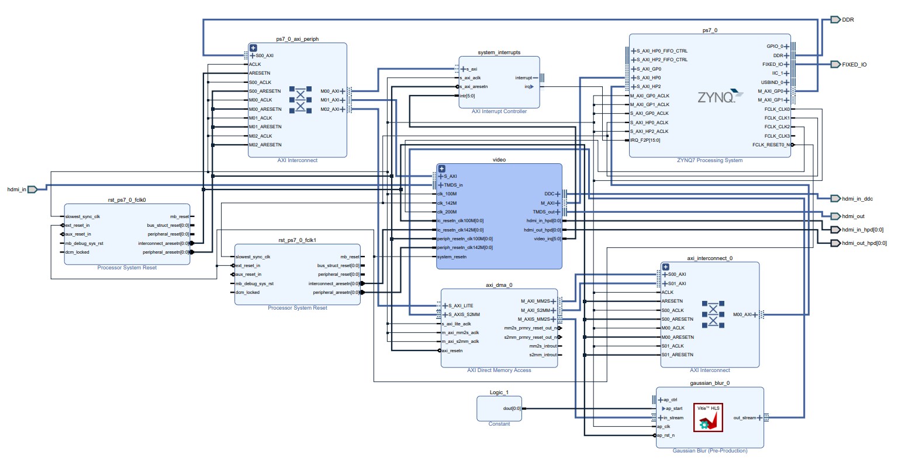

# Gaussian Blur FPGA Project

This project implements a real-time Gaussian Blur filter on the PYNQ-Z2 FPGA board using a custom HLS IP.

## Repository Structure
- **BlockDesign/**: Vivado project and block design files.
- **HLS_IP/**: C++ source and exported IP core.
- **Notebooks/**: Jupyter notebooks for testing and running the project on PYNQ.
- **Images/**: Sample images and results.

## How to Use
1. Open the Vivado project in `BlockDesign/`.
2. Program the FPGA with the bitstream.
3. Run the Jupyter notebook `Notebooks/gaussian_demo.ipynb` on the PYNQ board.

## Requirements
- Vivado 2022.1
- Vitis HLS 2022.1
- PYNQ 2.7

## Author
- Meita Shimony
