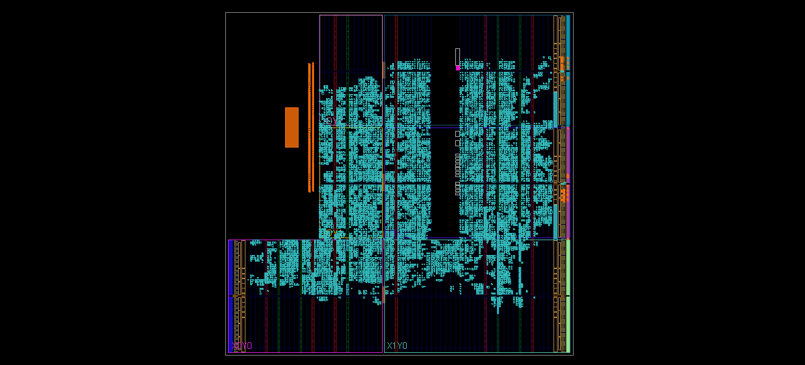

# Image Processing Filter Acceleration FPGA Project

This project implements a real-time Gaussian Blur filter using a custom-designed HLS IP on the PYNQ-Z2 FPGA board.  
The system is fully AXI4-Stream compatible and integrates with DMA and HDMI interfaces.

---

## 🛠 Block Design

The following figure shows the system pipeline implemented in Vivado Block Design:

**Pipeline Overview:**
- The video stream is received through DMA or HDMI input.
- Frames are passed pixel-by-pixel to the custom HLS Gaussian Blur IP.
- The filtered video is sent to memory via DMA or to an HDMI output for real-time display.
- All components communicate over AXI-Stream interfaces (TVALID, TREADY, TDATA, TUSER, TLAST).

---

## 📈 Synthesis Report

The Gaussian Blur IP was synthesized using Vitis HLS 2022.1.

**Key Highlights:**
- Fully pipelined implementation.
- Initiation Interval (II) = 1 (one pixel per clock cycle).
- Optimized for low resource utilization and real-time video processing.

> *A full synthesis report will be added here in the future, including resource usage (LUTs, FFs, DSPs) and timing information.*

---

## 🎥 Jupyter Notebook Implementation (Coming Soon)

In the next phase of the project, the system will be tested from a Jupyter Notebook running on the PYNQ board.

This section will include:
- Loading frames from camera or file.
- Sending frames through the FPGA Gaussian Blur filter.
- Capturing HDMI output screenshots.
- Measuring real-time performance.

> *Example screenshots of the HDMI output will be added here.*

---

## 📋 Requirements

- Vivado 2022.1
- Vitis HLS 2022.1
- PYNQ 2.7 image
- PYNQ-Z2 FPGA Board

---

## 👤 Author

- Meitar Shimoni

---

## 📜 License

This project is released under the MIT License.
