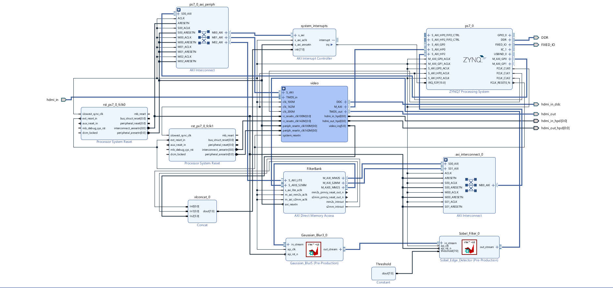
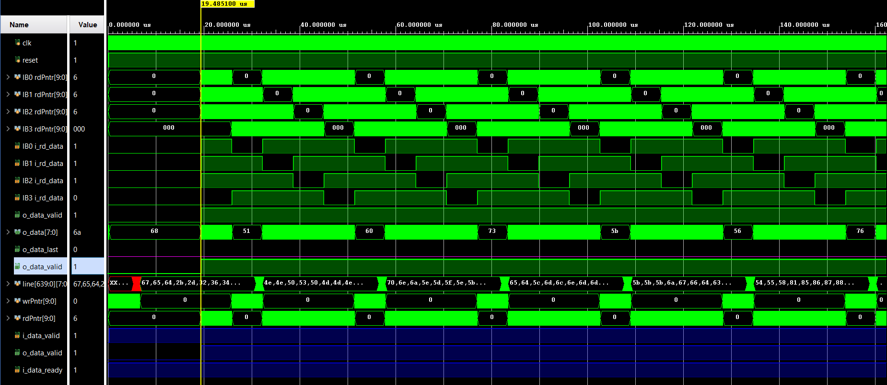
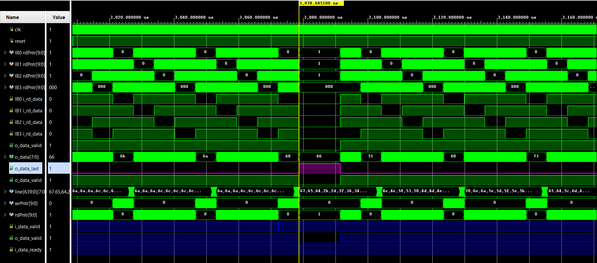
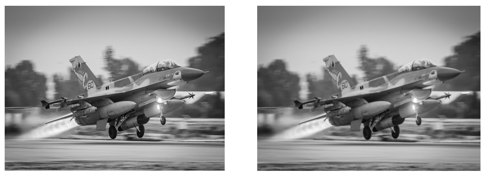
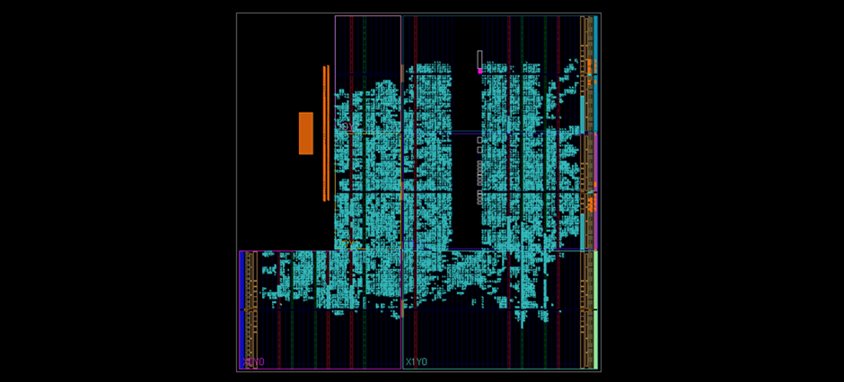
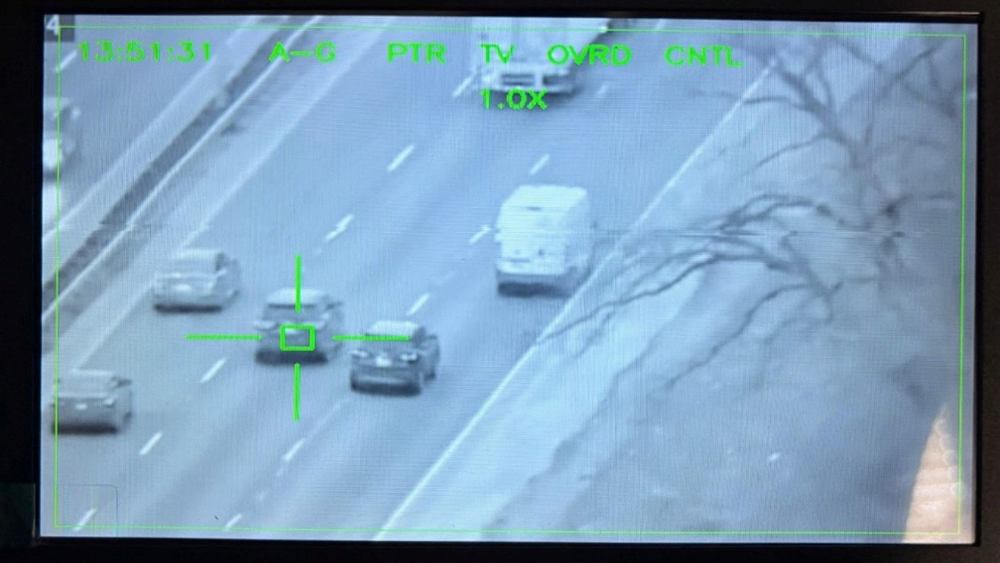
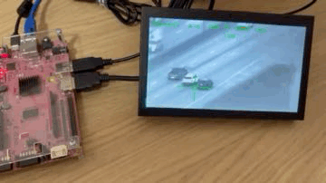

# Real-Time Video Processing TGP on PYNQ-Z2

This project implements a **real-time video processing system** inspired by an F-16's Targeting Pod (TGP).  
It captures video from a USB camera, performs **hardware-accelerated filtering** on a PYNQ-Z2 FPGA, tracks objects via software algorithms, and displays the augmented video feed via HDMI.

---

## 🚀 Key Features
- **End-to-End Video Pipeline** – Capture, process, and display video in real-time.
- **Hardware Acceleration** – Custom 3×3 Gaussian blur filter in RTL (Verilog) for high-throughput, low-latency processing.
- **Software/Hardware Co-Design** – Zynq SoC with ARM PS running Python & PL doing pixel-intensive processing.
- **Object Tracking** – Pyramidal Lucas-Kanade optical flow algorithm in OpenCV.
- **AXI-Stream Protocol** – Efficient, backpressure-managed hardware pipeline.
- **Interactive Control** – Onboard buttons/LEDs for live user interaction.

---

## 🖥 System Architecture
1. **Capture** – Python & OpenCV grab frames from USB camera.
2. **Transfer to PL** – AXI DMA sends frames from DDR (PS) to custom filter IP (PL).
3. **Hardware Filtering** – Gaussian 3×3 convolution applied pixel-by-pixel.
4. **Transfer to PS** – Filtered frame returned via DMA.
5. **Software Processing** – Lucas-Kanade tracking & TGP graphics overlay.
6. **Display** – Augmented frames sent to HDMI output.

---

## 🛠 Vivado Block Design
This diagram shows the Zynq PS, AXI DMA, Gaussian Filter IP, and video/GPIO peripherals.

 

---

## ⚙ Hardware Design (PL)
- **3×3 Convolution with Line Buffers** – Previous two rows stored, plus shift registers for current row, enabling one pixel per clock throughput.
- **RTL Verification** – Vivado Simulator checks AXI-Stream TVALID/TREADY handshake and TLAST frame boundaries.

---

## 📊 Simulation Results

**Simulation Waveform (Start-of-Frame)**  
 

**Simulation Waveform (End-of-Frame)**  
 

**Visual Verification**  
_Input and output of the Simulation_  

---

## 🏗 Implementation Results
**Device View (Post-Synthesis Layout)**  
 

---

## 💻 Software Design (PS)
- **Control** – Python in Jupyter Notebook.
- **Libraries** – `pynq` for hardware control, `cv2` for tracking & camera input.
- **User Interface** – Onboard buttons via AXI GPIO for start/reset/stop.

---

## 🎯 System in Action

---

## 📌 Getting Started
1. Use a **PYNQ-Z2** board with latest PYNQ image.
2. Clone this repository to the board.
3. Connect a 1080p HDMI monitor and USB webcam.
4. Open the `.ipynb` notebook in Jupyter Labs.
5. Run all cells to start the application.

---

## 🔮 Future Work
- Move entire pipeline to **hardware** to reduce latency.
- Implement **advanced tracking algorithms** in PL.
- Add **dynamic filter selection** from Python.

---

## 📋 Notes Table

|   |   |   |   |
|---|---|---|---|
|   |   |   |   |
|   |   |   |   |

