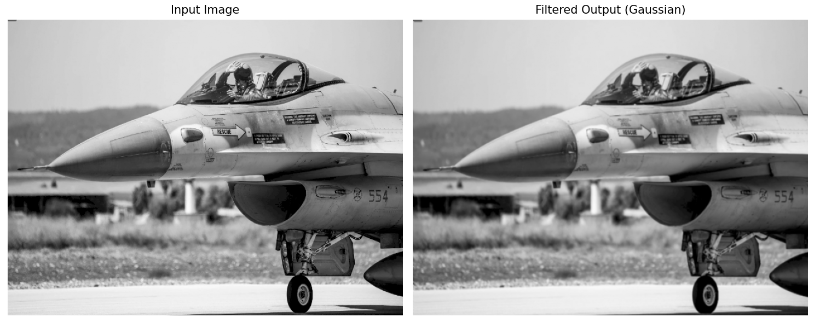
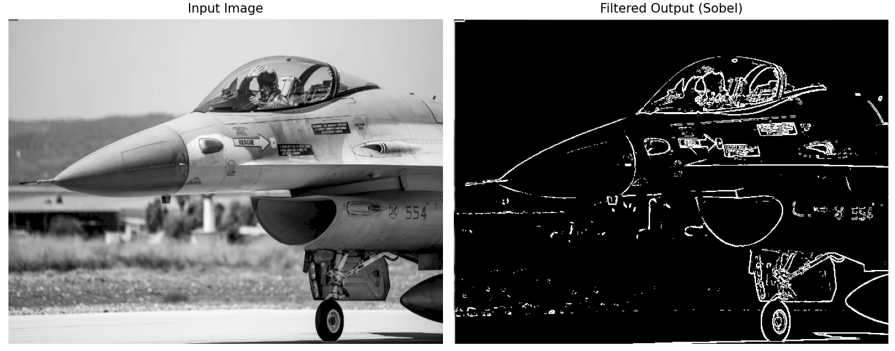

# Image Processing Filter Acceleration FPGA Project

This project implements a real-time Gaussian Blur filter using a custom-designed HLS IP on the PYNQ-Z2 FPGA board.  
The system is fully AXI4-Stream compatible and integrates with DMA and HDMI interfaces.

---

## 🛠 Block Design

The following figure shows the system pipeline implemented in Vivado Block Design:

**Pipeline Overview:**
- The video stream is received through DMA or HDMI input.
- Frames are passed pixel-by-pixel to the custom HLS Gaussian Blur IP.
- The filtered video is sent to memory via DMA or to an HDMI output for real-time display.
- All components communicate over AXI-Stream interfaces (TVALID, TREADY, TDATA, TUSER, TLAST).

---
## ✨ Filter Descriptions & Results

🔹 Gaussian Blur Filter
The Gaussian Blur is a low-pass filter used to smooth images and reduce noise by averaging pixel values using a weighted 3×3 kernel. This filter is useful for preprocessing before edge detection or reducing image detail.
Functional Highlights:
- Operates on 8-bit grayscale pixels
- Uses a 3×3 Gaussian kernel:
- Normalized by 16
- Streaming input/output via AXI4-Stream
- Latency: ~80 ns | II = 1
C Simulation Results:

🔹 Sobel Edge Detection Filter
The Sobel filter highlights edges by computing the gradient magnitude in both the horizontal and vertical directions. It is effective in detecting contours and transitions in intensity.

Functional Highlights:
- 3×3 Sobel kernels (Gx and Gy)
- Output is the magnitude of gradients: |Gx| + |Gy|
- Normalized and thresholded to binary (0 or 255)
- Threshold input is configurable (8-bit value via pin)
- Latency: ~90 ns | II = 1
- ap_ctrl_none interface — runs without AXI4-Lite

C Simulation Results:

---
## 📈 Synthesis Report

The Gaussian Blur IP was synthesized using Vitis HLS 2022.1.

**Key Highlights:**
- Fully pipelined implementation.
- Initiation Interval (II) = 1 (one pixel per clock cycle).
- Optimized for low resource utilization and real-time video processing.

> *A full synthesis report will be added here in the future, including resource usage (LUTs, FFs, DSPs) and timing information.*

---

## 🎥 Jupyter Notebook Implementation (Coming Soon)

In the next phase of the project, the system will be tested from a Jupyter Notebook running on the PYNQ board.

This section will include:
- Loading frames from camera or file.
- Sending frames through the FPGA Gaussian Blur filter.
- Capturing HDMI output screenshots.
- Measuring real-time performance.

> *Example screenshots of the HDMI output will be added here.*

---

## 📋 Requirements

- Vivado 2022.1
- Vitis HLS 2022.1
- PYNQ 2.7 image
- PYNQ-Z2 FPGA Board

---

## 👤 Author

- Meitar Shimoni

---

## 📜 License

This project is released under the MIT License.
